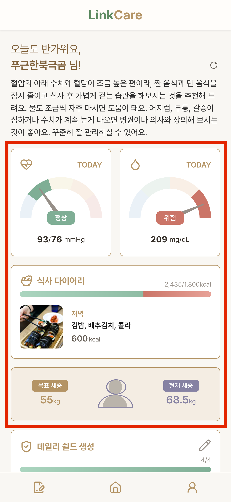

# 개인 작업 상세

## 담당 영역
- **HOME** - 데일리 건강 관리 일부 기능
- **식사 다이어리** - 전체 기능
- **마이페이지** - 전체 기능
- **UI / 퍼블리싱** - 프로젝트 전체 화면의 UI 구성 및 스타일 구현
- **API / 데이터 처리** - 담당 기능의 API 구현 및 데이터 처리

 

### 1. HOME(데일리 건강 관리)

|데일리 건강 관리|
|--|
||

- **혈압/혈당 공통**
  - 최신 날짜의 데이터를 기준으로 측정값을 조회한다.
  - 오늘 날짜의 데이터라면 `TODAY`를 표시한다.
  - 이전 날짜의 데이터라면 해당 측정 날짜를 표시한다.

- **혈압 우선순위**
  - 오후 측정값이 존재하면 오후 데이터를 우선 표시한다.
  - 오후 데이터가 없을 경우 오전 데이터를 표시한다.

- **혈당 우선순위**
  - 다음 우선순위에 따라 가장 먼저 존재하는 데이터를 표시한다.
    1. 저녁 식후
    2. 저녁 식전
    3. 점심 식후
    4. 점심 식전
    5. 아침 식후
    6. 아침 식전

- **식사 다이어리**
  - 오늘 날짜의 목표 칼로리 대비 섭취 칼로리를 표시한다.
  - 가장 최근에 등록된 식사 데이터를 표시한다.
    - 음식 사진
    - 음식 내용
    - 칼로리

- **체중**
  - 목표 체중을 표시한다.
  - 최근 측정된 체중을 표시한다.
  - 현재 체중과 목표 체중을 숫자 및 인포그래픽으로 표현한다.

 

### 2. 식사 다이어리

|식사|식사 입력|목표 칼로리|
|--|--|--|
||||

- **식사 기록 조회**
  - 처음 화면에 진입하면 오늘 날짜의 아침/점심/저녁 식사 데이터를 생성한다.
  - 화면 상단의 달력을 통해 원하는 날짜의 식사 기록을 조회할 수 있다.
  - 최대 3개월간의 식사 기록을 조회할 수 있다.

- **칼로리 관리**
  - 목표 칼로리와 실제 섭취 칼로리를 시각화하여 비교할 수 있다.
  - 목표 칼로리 대비 섭취 칼로리의 비율에 따라 랜덤한 응원 문구를 노출한다.

- **식사 등록**
  - 아침/점심/저녁 식사를 각각 등록할 수 있다.
  - 식사 기록은 당일에만 등록할 수 있도록 제한한다.
  - `안먹었어요` 버튼을 통해 해당 식사를 먹지 않았음을 기록할 수 있다.
  - 식사 여부 데이터는 HOME 화면의 AI 코멘트 생성에 활용한다.

- **AI 음식 분석**
  - 음식 사진을 AI로 분석하여 음식명과 칼로리 정보를 제공한다.
  - AI 분석 결과는 사용자가 직접 수정할 수 있다.

#### AI 음식 분석 예외 처리 및 UX 개선
- AI 분석 결과가 반환되기까지 시간이 오래 걸리거나 분석에 실패하는 경우가 종종 발생했다.
- AI API 요청 전에 사진의 크기를 줄여 전송 용량을 최소화했다.
- AI 분석 요청이 실패할 경우 최대 3회까지 재시도하도록 구현하여 분석 성공 가능성을 높였다.

 

### 3. 마이페이지

|마이페이지|회원정보 수정|비밀번호 변경|회원 탈퇴|
|--|--|--|--|
|||||

- **회원 정보 수정**
  - 닉네임, 성별, 생년월일, 키 정보를 각각의 바텀시트를 통해 수정할 수 있도록 구현했다.
  - 닉네임은 서버에서 랜덤으로 생성할 수 있도록 구현했으며, 닉네임 변경 시 중복 여부를 확인하도록 처리했다.

- **비밀번호 변경**
  - 현재 비밀번호와 변경할 비밀번호를 API로 전달한다.
  - 서버에서 현재 비밀번호의 일치 여부를 검증한 후 비밀번호를 변경하도록 구현했다.

- **회원 탈퇴**
  - 탈퇴 전 안내 문구에 대한 동의 여부를 확인한 후 비밀번호를 검증하도록 구현했다.
  - 비밀번호 검증이 완료되면 회원 탈퇴를 진행한다.
  - 회원 탈퇴가 완료되면 서버에서 JWT 인증 쿠키를 만료 처리하고, 프론트엔드에서도 인증 상태를 초기화하여 로그아웃 처리한다.

